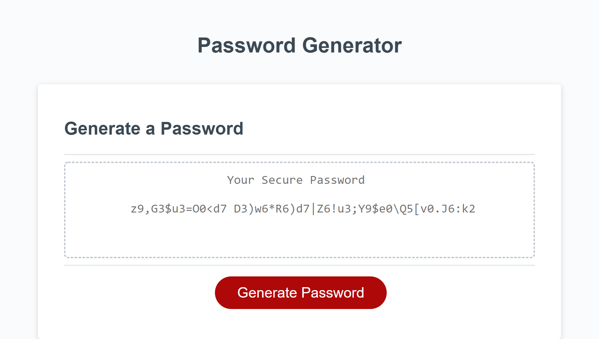

# password-generator-repo
Password Generator Project

## Description

- What was your motivation?

    My motivation for tackling the project was to learn how to use object variables, for loops with if/else conditions, and window prompts to improve my javascript learning.

- Why did you build this project? (Note: the answer is not "Because it was a homework assignment.")

    I built the project to further develop my javascript skills with object variables and window methods like prompt, confirm and alert. 

- What problem does it solve?

    Learning about object methods and function scope helps with tackling the problem with writing and organizing readable javascript code.

- What did you learn?

    I learned different types of functions and variables along with function methods to improve my javascript learning.

## ScreenShot

## Link to Deployed Website

https://acromarti01.github.io/password-generator-repo/

